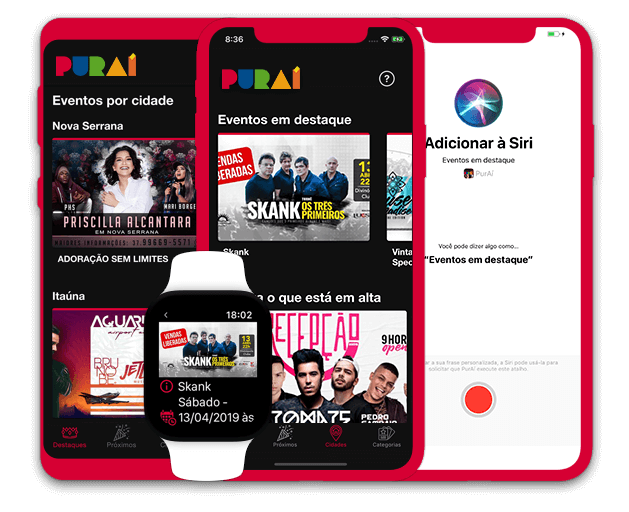

<h1 align="center">PurAí</h1>

  Os melhores eventos em Divinópolis e região

  

  
  

## About

PurAí is a platform that aims to centralize all the events that happens in Divinópolis and region in a simple and practical way.

### Features

A few of the things PurAí offers:

* Available for all iOS and Android phones.
* Siri Shortcuts support.
* WatchOS app.
* Funky and intuitive design.
* It gathers, in a single application, all the events that happens in Divinópolis and region.
* It allows to find events that will happen in current day and those that will happen soon.
* Helps locate the events that will happen near you. Just select a city to view the events.
* Possibility to share events with contacts and social networks.

## License
This project is licensed under the GNU GPLv3 License - see the [LICENSE](LICENSE) file for details

Made with :heart: by [Felipe Mendes](https://github.com/felipemendes).
